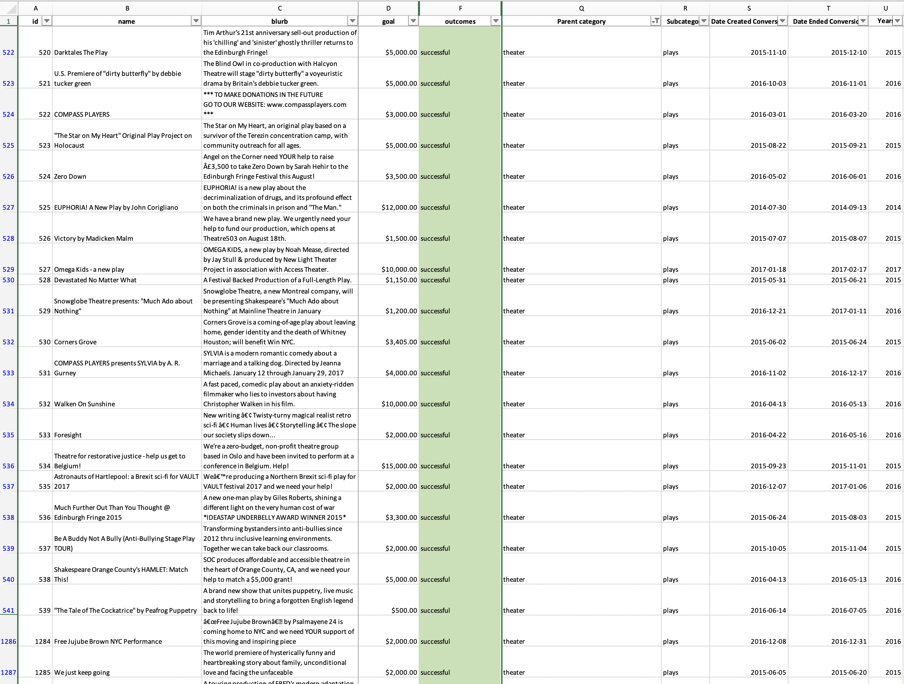
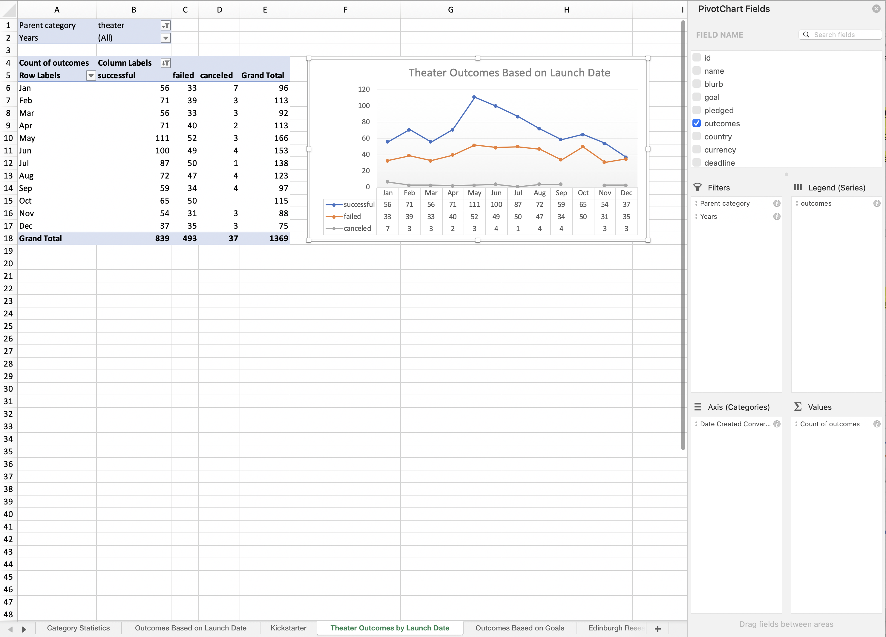
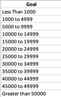
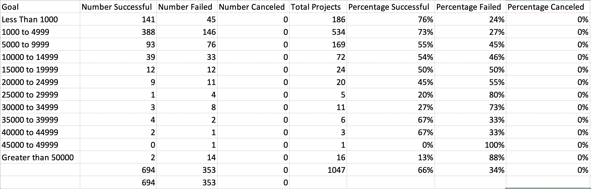
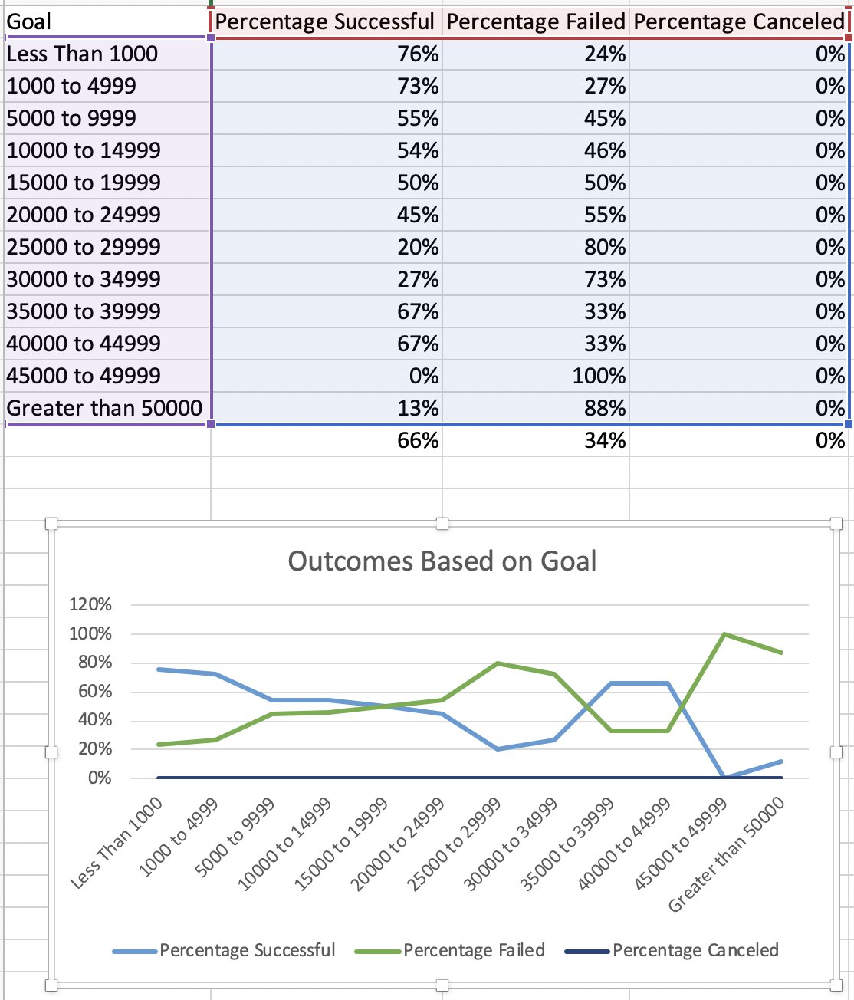
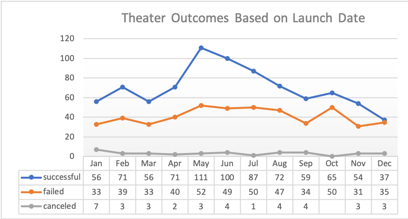

# Kickstarter Dataset Analysis.
## Overview of Project
### Purpose: 
I was given Kickstarter dataset that was provided by the client. They want to know how different theater campaigns fared in relation to their launch dates and their funding goals from the Kickstarter dataset in different countries. The client needs to see visualized campaign outcomes based on their launch dates and their funding goals from 2010 to 2017. 
## Analysis and Challenges
 I went through the Kickstarter Dataset excel file that was provided to me by the client. I have identified certain columns with specific data that I will be using in my analysis. There is column D “Goal”, column F “Outcomes”, column Q “Parent category”, column R “Subcategory”, column S “Date Created Conversion”. 
 For the first part of project, I have created **a new column U “Year”** in order to extract the year from the “Date Created Conversion” column S. 
 Please see below the Kickstarter worksheet screen shot: 
  
 I have used a pivot table method and graphing in Excel file to visualize campaign outcomes ("successful," "failed," and "canceled") based on launch date from 2010 to 2017.  
 I have reviewed the data that was given me. I have created a new worksheet “Theater Outcomes by Launch Date”. Then, I filtered the pivot table based on "Parent Category" and "Years." Next, I placed the appropriate pivot table fields in the columns, rows, and values. Finally, I filtered the column labels to show only "successful," "failed," and "canceled." 
 Also, I filtered the "Parent Category" to show only the data for "theater” and sorted the campaign outcomes in descending order so "successful" is first. 
 As a result, I created a line chart from the pivot table to visualize the relationship between outcomes and launch month. 
 Please see below the “Theater Outcomes by Launch Date” screen shot: 
  
 This chart shows grand total number of successful theater projects is 839; 
 grand total number of failed theater projects is 493; 
 grand total number of canceled theater projects is 37. 
 For the second part of the project, in order for me to analyze the outcomes based on goals, I have tried to visualize the percentage of successful, failed, and canceled plays based on the funding goal amount. I have used COUNTIFS() function in the excel worksheet to collect the outcome and goal data for the “plays” subcategory.  
 In a new worksheet “Outcomes Based on Goals”, I have created the following columns to hold the data: goal, number successful, number failed, number canceled, total projects, percentage successful, percentage failed and percentage canceled. 
 In the “Goal” column, I created the following dollar-amount ranges so projects can be grouped based on their goal amount. 

 I calculated the percentage of successful, failed, and canceled projects for each row. 
 Please see below the Outcomes Based on Goals screen shot: 
  
 I have created a line chart titled "Outcomes Based on Goal" to visualize the relationship between the goal-amount ranges on the x-axis and the percentage of successful, failed, or canceled projects on the y-axis. 
  
### Analysis of Outcomes Based on Launch Date
  
 Outcomes Based on Launch Date Chart shows the number of successful, failed, or canceled theater projects by month. 
 I concluded from the “Theater Outcomes Based on Launch Date” line chart: 
 1.	The most active month for theater campaigns is May, there is a spike of a successful outcomes in a graph with 111 campaigns.
2.	When comparing a data for the whole year from the above chart we can see that the peak months were May-July.  The number of outcomes were equal or higher than 72 per month.
3.	The graph also shows the highest number of cancelled projects in January, there were 7 projects cancelled.
4.	From October to December we can see a decline where number of successful theater outcomes is almost equal to failed once.  
 
### Analysis of Outcomes Based on Goals
  
  
